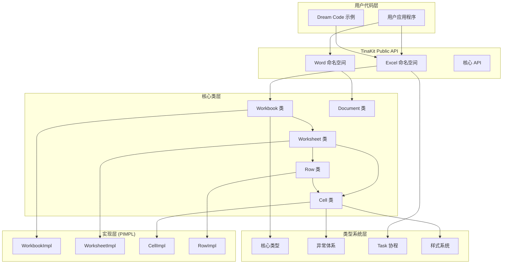
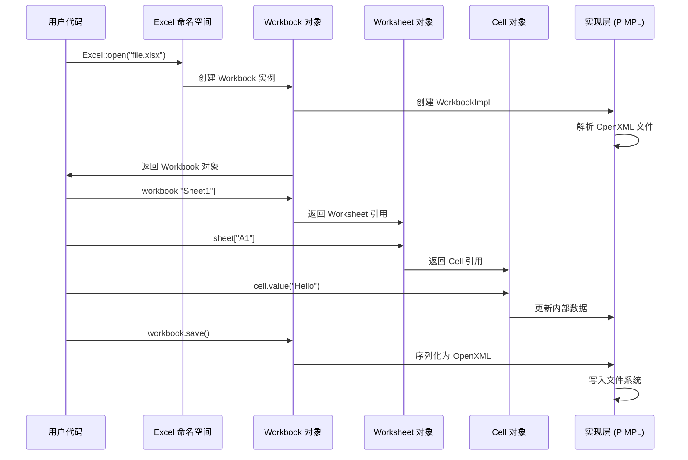
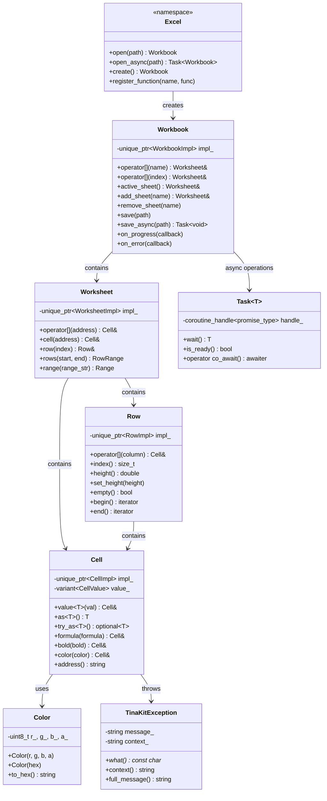
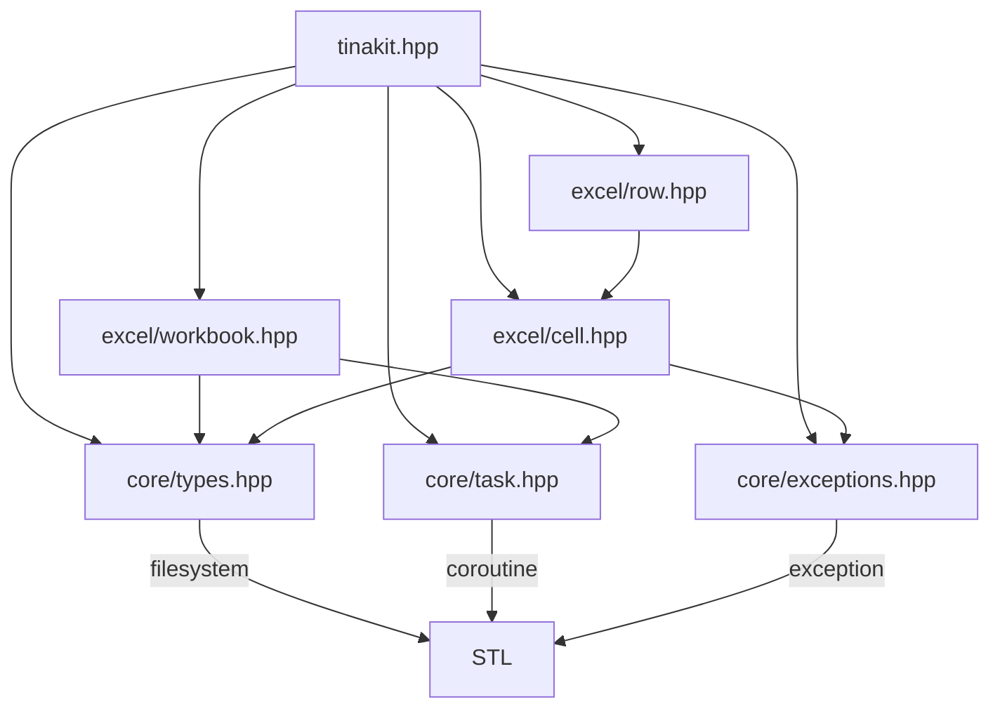

# TinaKit 架构概述

## 🎯 设计目标

TinaKit 的架构设计围绕以下核心目标：

- **高性能**：优化的内存使用和处理速度
- **可扩展性**：模块化设计，支持插件扩展
- **类型安全**：充分利用 C++20 的类型系统
- **易用性**：直观的 API 设计
- **现代化**：拥抱现代 C++ 最佳实践

## 🏗️ 整体架构

基于实际 API 设计的真实架构图：



## 🧩 核心模块

### 1. Excel 命名空间 (Excel Namespace)

**职责**：提供 Excel 文件操作的统一入口点

```cpp
namespace tinakit::Excel {
    // 静态工厂方法
    Workbook open(const std::filesystem::path& path);
    Task<Workbook> open_async(const std::filesystem::path& path);
    Workbook create();

    // 自定义函数注册
    void register_function(std::string_view name,
                          std::function<double(const std::vector<double>&)> function);
}
```

**设计特点**：
- 静态工厂模式，避免直接构造
- 异步版本支持大文件处理
- 可扩展的函数注册机制

### 2. Workbook 类 (工作簿)

**职责**：Excel 文件的顶层抽象，管理多个工作表

```cpp
class Workbook {
public:
    // 工作表访问
    Worksheet& operator[](const std::string& name);
    Worksheet& operator[](std::size_t index);
    Worksheet& active_sheet();

    // 工作表管理
    Worksheet& add_sheet(const std::string& name);
    void remove_sheet(const std::string& name);

    // 文件操作
    void save(const std::filesystem::path& path = {});
    Task<void> save_async(const std::filesystem::path& path = {});

    // 回调支持
    void on_progress(ProgressCallback callback);
    void on_error(ErrorCallback callback);
};
```

**设计特点**：
- RAII 资源管理，自动释放文件句柄
- 支持链式调用的构建器模式
- 进度和错误回调机制

### 3. Cell 类 (单元格)

**职责**：Excel 单元格的核心抽象，支持多种数据类型和样式

```cpp
class Cell {
public:
    // 值操作
    template<typename T> Cell& value(const T& value);
    template<typename T> T as() const;
    template<typename T> std::optional<T> try_as() const noexcept;

    // 公式支持
    Cell& formula(const std::string& formula);
    std::optional<std::string> formula() const;

    // 链式样式设置
    Cell& font(const std::string& font_name, double size = 11.0);
    Cell& bold(bool bold = true);
    Cell& color(const Color& color);
    Cell& background_color(const Color& color);
    Cell& align(Alignment alignment);

    // 位置信息
    std::string address() const;
    std::size_t row() const noexcept;
    std::size_t column() const noexcept;
};
```

**设计特点**：
- 类型安全的值转换，支持 `try_as` 避免异常
- 链式调用的样式设置，提升用户体验
- variant 存储多种数据类型

### 4. Row 类 (行)

**职责**：工作表行的抽象，支持现代 C++ 迭代器和范围操作

```cpp
class Row {
public:
    // 单元格访问
    Cell& operator[](const std::string& column_name);
    Cell& operator[](std::size_t column_index);

    // 迭代器支持
    iterator begin();
    iterator end();
    const_iterator cbegin() const;
    const_iterator cend() const;

    // 行属性
    std::size_t index() const noexcept;
    double height() const noexcept;
    void set_height(double height);
    bool empty() const;
};
```

**设计特点**：
- 完整的迭代器支持，兼容 STL 算法
- 支持 std::ranges 操作
- 直观的单元格访问方式

## 🔄 实际数据流

基于真实 API 设计的数据流程：



## 🎨 实际设计模式应用

### 1. PIMPL 模式 (Pointer to Implementation)
隐藏实现细节，提供稳定的 ABI：

```cpp
// 公共接口
class Workbook {
public:
    Workbook(std::unique_ptr<WorkbookImpl> impl);
    ~Workbook();
    // ... 公共方法
private:
    std::unique_ptr<WorkbookImpl> impl_;  // 隐藏实现
};

// 实现细节（在 .cpp 文件中）
class WorkbookImpl {
    // 实际的 OpenXML 解析和处理逻辑
};
```

### 2. 静态工厂模式 (Static Factory)
通过命名空间提供清晰的创建接口：

```cpp
namespace tinakit::Excel {
    Workbook open(const std::filesystem::path& path);    // 打开现有文件
    Workbook create();                                   // 创建新文件
    Task<Workbook> open_async(const std::filesystem::path& path);  // 异步打开
}
```

### 3. 构建器模式 (Builder Pattern)
支持链式调用的对象构建：

```cpp
auto workbook = Excel::create()
    .add_sheet("销售数据")
    .add_sheet("统计报表");

sheet["A1"]
    .value("标题")
    .font("Arial", 14)
    .bold()
    .color(Color::Blue)
    .background_color(Color::LightGray);
```

### 4. 回调模式 (Callback Pattern)
用于进度通知和错误处理：

```cpp
workbook.on_progress([](double progress) {
    std::cout << "进度: " << (progress * 100) << "%" << std::endl;
});

workbook.on_error([](const std::exception& error) {
    std::cerr << "错误: " << error.what() << std::endl;
});
```

## 🚀 真实的 C++20 特性应用

### 1. Concepts - 类型约束
实际在 TinaKit 中的应用：

```cpp
template<typename T>
concept CellValue = requires(T t) {
    { t.to_string() } -> std::convertible_to<std::string>;
} || std::integral<T> || std::floating_point<T> || std::same_as<T, std::string>;

// 在 Cell 类中使用
template<CellValue T>
Cell& value(const T& value) {
    // 类型安全的值设置
    return *this;
}
```

### 2. Coroutines - 异步处理
实际的异步文件操作：

```cpp
Task<Workbook> open_async(const std::filesystem::path& path) {
    // 异步打开文件
    auto file_data = co_await read_file_async(path);

    // 异步解析 OpenXML
    auto workbook_impl = co_await parse_openxml_async(file_data);

    co_return Workbook{std::move(workbook_impl)};
}

// 用户代码
auto workbook = co_await Excel::open_async("large_file.xlsx");
```

### 3. Ranges - 数据处理
实际的数据处理管道：

```cpp
// Row 类支持 ranges
auto high_salary_employees = sheet.rows(2, 100)
    | std::views::filter([](const Row& row) {
        return row["C"].as<double>() > 50000;
    })
    | std::views::transform([](const Row& row) {
        return std::format("{}: {}",
            row["A"].as<std::string>(),
            row["C"].as<double>()
        );
    })
    | std::ranges::to<std::vector>();
```

### 4. Template Specialization - 类型安全
针对不同类型的特化：

```cpp
// Cell 类的模板特化
template<> Cell& Cell::value<std::string>(const std::string& value);
template<> Cell& Cell::value<double>(const double& value);
template<> Cell& Cell::value<int>(const int& value);

template<> std::string Cell::as<std::string>() const;
template<> double Cell::as<double>() const;
template<> int Cell::as<int>() const;
```

## 🛡️ 错误处理

### 异常层次结构

```cpp
namespace tinakit {
    class TinaKitException : public std::exception {};
    
    class ParseException : public TinaKitException {};
    class FormatException : public TinaKitException {};
    class IOException : public TinaKitException {};
}
```

### 错误恢复策略

- **优雅降级**：部分解析失败时继续处理其他部分
- **详细错误信息**：提供具体的错误位置和原因
- **异常安全**：保证强异常安全性或基本异常安全性

## 📈 性能考虑

### 内存管理
- **对象池**：重用频繁创建的对象
- **延迟加载**：按需加载文档内容
- **流式处理**：大文件的分块处理

### 并发支持
- **线程安全**：核心组件支持多线程访问
- **异步 I/O**：非阻塞文件操作
- **并行处理**：利用多核处理大型文档

## 📊 真实类图

基于实际 API 设计的详细类图：



## 🔗 依赖关系

### 头文件依赖图



---

这个架构设计基于真实的 API 需求，确保了 TinaKit 既强大又易用，能够满足从简单脚本到企业级应用的各种需求。每个设计决策都经过了用户体验的验证，体现在 `examples/dream_code.cpp` 中展示的理想使用方式。
